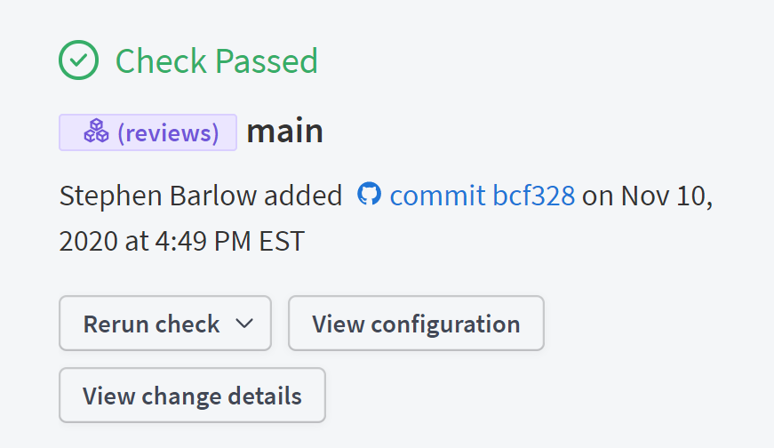

## Graph vs Subgraph

> TODO

### Graph Refs

> TODO

## Using stdout

`stdout` is a stream that processes can write to. For Rover, `stdout` is usually
the result of a command, whether that be SDL output, checks errors, or
composition errors.

Rover was designed to allow the output to `stdout` to be as flexible as
possible. This means that any command that prints to `stdout` should only print
things in a format that could be usable elsewhere (like other CLI tools). Rover
is intentional about printing logs to `stderr` instead of `stdout`, to make sure
logs never show up in places they're not expected.

To redirect stdout to somwhere other than your terminal, you can use either the
pipe `|` or output redirect `>` operators.

The pipe operator is used to pass the `stdout` of one command to the `stdin`
(the standard input stream) of another process.

```bash
rover graph introspect http://localhost:4000 | pbcopy
```

The above example shows the output of the `introspect` command being piped to
`pbcopy`, a common tool in Mac OS which copies values to the clipboard. Rover
also can use values from `stdin`, which is explained [below](#using-stdin).

In addition to the pipe, the output redirect operator is especially useful for
handling `stdout`.

```bash
rover graph fetch my-graph@prod > schema.graphql
```

The output redirect operator, as shown in this example is useful for pushing
the output from `stdout` to a file (here that's `schema.graphql`). If this file
already exists, it will be overwritten. If it doesn't, it will be created.

## Using stdin

To be as flexible as possible, Rover allows for certain input values to be
provided from `stdin`. This means that Rover can accept the output from another
command as input.

Rover follows fairly common conventions for using `stdin`. Wherever Rover allows
`stdin` to be used, you can pass `-` to signify that you'd like to use `stdin`
rather than a file path.

Right now, the only place `stdin` is fully supported is the `--schema` flag used
in many of the `graph` and `subgraph` commands. Using `stdin` for schema inputs
can be convenient when using Rover (or other command line tools) to generate
SDL.

```bash
rover graph introspect http://localhost:4000 | rover graph check my-graph --schema -
```

## Git Context

TODO: I'm not quite sure about how to explain the usefulness of the git info
in studio

Some commands use the context of your git project to improve the experience 
in Apollo Studio. The checks page shows this info, and can help find and filter
checks as well as  make it possible to link between a check and its pull request
in GitHub.



By default, Rover uses the git context in all `check` and
`push` commands, based on the directory that Rover is run from.

Rover uses the following pieces of git info automatically, but each can be 
overwritten by an environment variable:

- Branch Name: `APOLLO_VCS_BRANCH`
- Author (committer): `APOLLO_VCS_COMMITTER`
- Commit hash (short): `APOLLO_VCS_COMMIT`
- Sanitized Remote Url: `APOLLO_VCS_REMOTE_URL`
